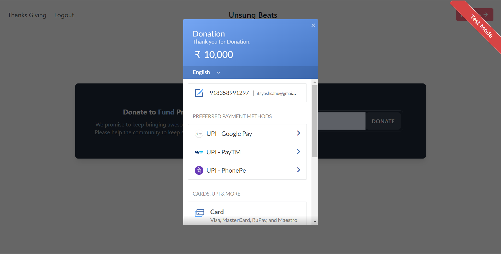

This is just Dommy Payment Gateway Intergration 

-- Signup and Login Using Firebase 
-- Basic User Interface Using Tailwind;

Do Not Worry to Make Payments this is just the test Mode

Homepage ( Sign Up Page )

DashBoard 

Payment Gateway Interface 

Other Screen-shots 

